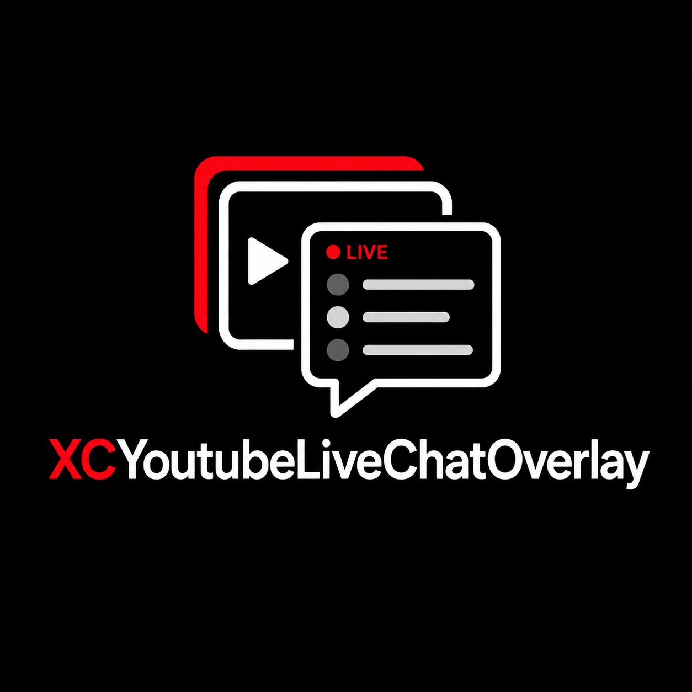

# Antigravity LiveChat Overlay

<p align="center">
  
</p>

A premium, hardware-accelerated, transparent always-on-top YouTube live chat overlay for Windows. Built natively using C# and WPF (.NET 8.0), this tool allows streamers, developers, and gamers to display a highly customizable live chat HUD directly over their gameplay or active windows without requiring a single YouTube API developer key.

---

## Key Features

- **Zero API Key Requirement**: Leverages Microsoft Edge's production-ready WebView2 container to render YouTube's official popout chat natively. It fully supports custom emotes, member badges, super chats, and live animations automatically.
- **Glassmorphic Dark Controller**: A beautiful, modern control center styled with deep dark themes, harmonic HSL colors, and smooth transition controls.
- **Interactive Drag & Resize (Edit Mode)**: When the overlay is unlocked, a visual boundary frame, top drag handle bar, and bottom resize grip appear, letting you position and size the overlay window with pixel perfection.
- **Invisible Borderless HUD (Locked Mode)**: When locked, all borders, title bars, and backgrounds become completely transparent, making the chat float seamlessly in the background.
- **Mouse Click-Through**: Lock the overlay in place to make it fully mouse-transparent. You can play games or browse websites right beneath the chat window without accidentally triggering clicks on the overlay.
- **Global Hotkeys**: Instantly toggle overlay locking (click-through and Edit Mode) at any time with a simple keyboard shortcut (`Ctrl + Shift + L`).
- **Real-time Customization**: Adjust opacity, font zoom scale, and theme styles on the fly with live preview.
- **Settings Persistence**: Automatically saves your configuration (URL, size, position, sliders, and presets) in a local `settings.json` file.

---

## Theme Presets Included

The overlay comes packed with premium pre-configured CSS layouts:

*   **Minimalist Bubbles**: Elegant, translucent chat bubbles with distinct username colors for Owners, Moderators, Members, and standard users.
*   **Neon Cyberpunk**: Cyberpunk neon cyan text with soft pink outlines, styled with a developer monospaced layout and faint outer glow.
*   **Clean Monospace**: A terminal console printout layout designed for tech streamers or coders.
*   **Glassmorphic Frost**: Frosted-glass backdrop with modern blur filters.
*   **Custom CSS Editor**: A live editor text box to inject your own custom stylesheets and style the chat exactly how you want.

---

## Quick Start Guide

### Prerequisites
- Windows OS
- .NET 8.0 SDK (or newer)
- Microsoft Edge / WebView2 Runtime (installed by default on modern Windows 10/11)

### How to Build & Run

1. Clone this repository:
   ```bash
   git clone https://github.com/XppaiCyberr/ytlivechat-overlay.git
   cd ytlivechat-overlay
   ```

2. Compile the application:
   ```bash
   dotnet build
   ```

3. Launch the application:
   ```bash
   dotnet run
   ```

---

## How to Use

1. **Enter Live Stream Link**: Copy and paste any standard YouTube live stream URL, live watch URL, popout chat URL, or direct 11-character Video ID into the controller, then click **LAUNCH OVERLAY**.
2. **Reposition and Resize (Edit Mode)**: Ensure click-through is **unchecked** (unlocked). A solid blue boundary border, top drag bar, and bottom-right resize grip will appear.
   - **To Move**: Click and hold the top bar and drag the window to your desired position.
   - **To Resize**: Hover your mouse over the bottom-right corner and drag the resize grip to change the size.
3. **Lock & Play (HUD Mode)**: Check the **Enable Mouse Click-Through (Lock Overlay)** box on the controller dashboard, or press **`Ctrl + Shift + L`** on your keyboard.
   - The blue border, drag handle, and resize grip will disappear instantly, and the background will become 100% transparent.
   - The overlay becomes click-through, allowing all clicks to pass straight through onto games or active windows beneath the chat.
4. **Customize**: Use the **Transparency** slider to make the background subtle, scale font sizes with the **Font Scaling** slider, and select your favorite theme preset.

---

## Hotkeys

| Shortcut | Description |
| :--- | :--- |
| **`Ctrl + Shift + L`** | **Toggle Lock / Mouse Click-Through** (Instantly switch between Edit Mode (drag-and-resize) and Locked HUD mode) |

---

## Technology Stack

- **Core**: C# / WPF (.NET 8.0)
- **Rendering**: Microsoft Edge WebView2 Control (`Microsoft.Web.WebView2`)
- **Interoperability**: Windows User32 Win32 API (`user32.dll`)
- **Format**: JSON (`System.Text.Json` for layout configuration persistence)
